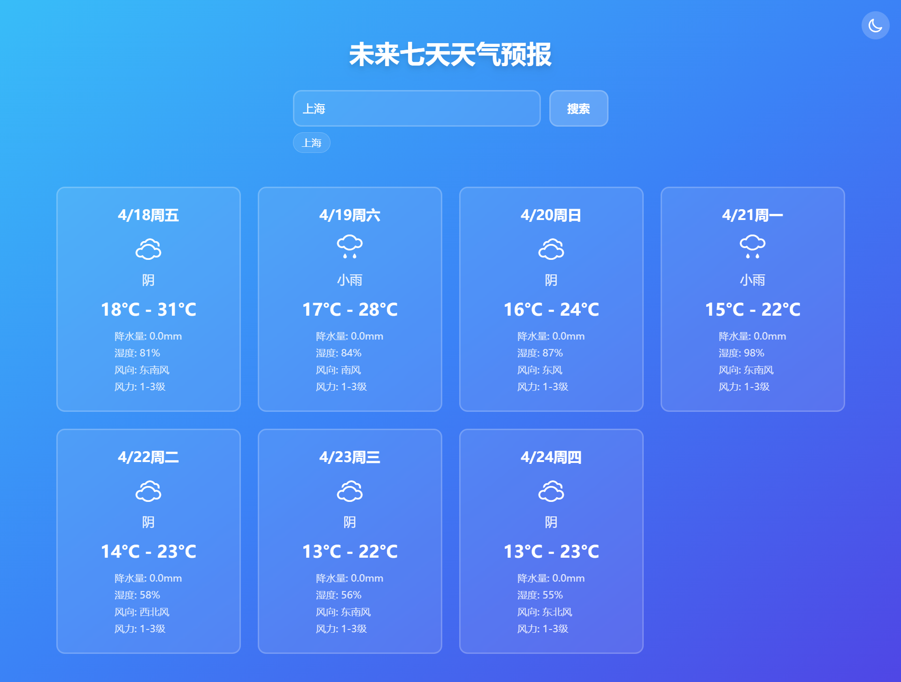
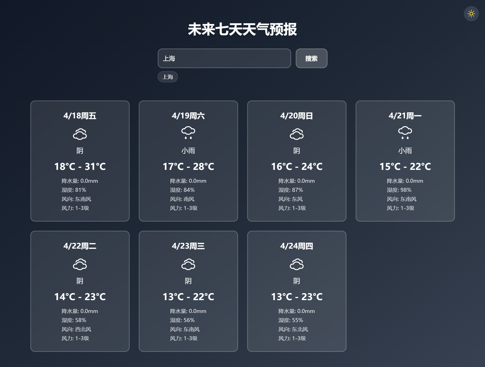

# 天气预报组件

### 一个可复用的 React 组件，用于显示未来 7 天的天气预报，使用 TypeScript、Vite 和 Tailwind CSS 构建。通过和风天气 API 获取数据，支持城市搜索、搜索历史和深色模式。

## 功能特性

- 显示未来 7 天的天气预报（温度、天气状况、风向、湿度、降水量）。
- 支持城市搜索，保留最近 5 次搜索历史。
- 深色模式切换，支持本地存储持久化。
- 使用 Tailwind CSS 实现响应式设计。
- 组件化架构，便于集成。

## 技术栈

- React
- TypeScript
- Vite（构建工具，版本 5.0.0）
- Tailwind CSS（版本 3.3.5）
- Axios（用于 API 请求）
- Yarn（包管理器）

## 安装步骤

### 克隆仓库：

```bash
git clone https://github.com/zzceaon/weather-forecast-widget.git
cd weather-forecast-widget
```

### 安装依赖：

```bash
yarn
```

### 启动开发服务器：

```bash
yarn dev
```

### 配置

#### WeatherForecast 组件需要通过 apiHost 和 apiKey 属性传入和风天气 API 的配置。你需要提供自己的和风天气 API 凭据。

##### 步骤 1：获取和风天气 API 配置

- 在和风天气开发者控制台注册账号。
  创建一个新项目，生成 API Key
  在控制台设置中获取 API Host
- 步骤 2：在组件中配置 API 凭据
  打开 src/App.tsx，将 apiHost 和 apiKey 的占位值替换为你的和风天气 API 凭据

#### 注意事项

- App.tsx 中的 apiHost 和 apiKey 初始值为占位符（YOUR_API_HOST 和 YOUR_API_KEY），需替换为你的和风天气 API 配置。
- 和风天气 API 免费版支持未来 7 天的天气预报和城市查询。
- 城市名称需使用中文输入（例如“上海”）。

### 构建生产版本

```bash
yarn build
```

### 构建结果将输出到 dist/ 目录。预览生产构建：

```bash
yarn preview
```

## 界面效果

### 白天



### 黑夜



## 贡献

- 欢迎贡献！请在 GitHub 上提交 issue 或 pull request。
