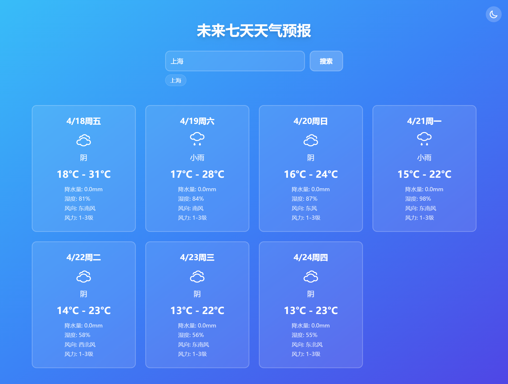
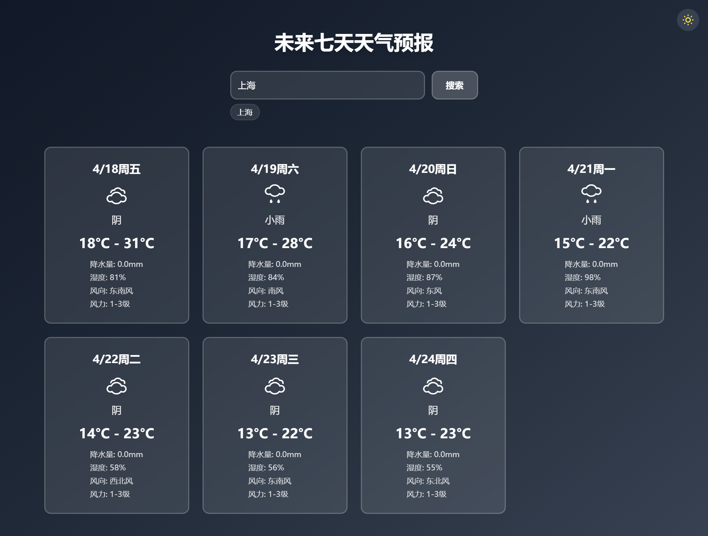

# Weather Forecast Component

### A reusable React component for displaying a 7-day weather forecast, built with TypeScript, Vite, and Tailwind CSS. It fetches data from the QWeather API and supports features like city search, search history, and dark mode.

## Features

- Displays a 7-day weather forecast (temperature, weather condition, wind, humidity, precipitation).
- Supports city search with history (up to 5 recent searches).
- Dark mode toggle with local storage persistence.
- Responsive design using Tailwind CSS.
- Component-based architecture for easy integration.

## Tech Stack

- React
- TypeScript
- Vite (build tool, version 5.0.0)
- Tailwind CSS (version 3.3.5)
- Axios (for API requests)
- Yarn (package manager)

## Installation

### Clone the repository:

```bash
git clone https://github.com/zzceaon/weather-forecast-widget.git
cd weather-forecast-widget
```

### Install dependencies:

```bash
yarn
```

### Run the development server:

```bash
yarn dev
```

### Configuration

#### The WeatherForecast component requires apiHost and apiKey props to interact with the QWeather API. You need to provide your own QWeather API credentials.

##### Step 1: Get QWeather API Credentials

- Sign up at QWeather Developer Console to create an account.
  Create a new project and generate an API key.
  Get the API Host in the console settings

- Step 2: Configure API Credentials in the Component
  Open src/App.tsx and replace the placeholder values for apiHost and apiKey with your own QWeather API credentials

#### Notes

- The apiHost and apiKey in App.tsx are initially set to placeholders (YOUR_API_HOST and YOUR_API_KEY). You must replace them with your own QWeather API credentials.
- The QWeather API free tier supports 7-day weather forecasts and city lookup.
- City names should be entered in Chinese (e.g., "上海" for Shanghai).

### Build for Production

```bash
yarn build
```

### The output will be in the dist/ directory. To preview the production build:

```bash
yarn preview
```

## Interface Effect

### Light



### Night



## License

- Contributions are welcome! Please open an issue or submit a pull request on GitHub.
